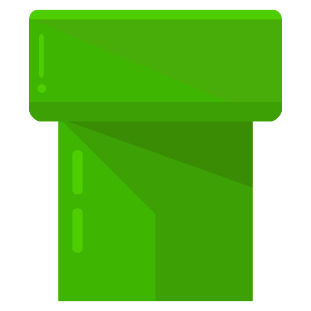
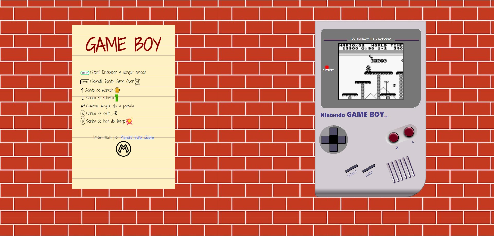

[](https://git.io/typing-svg)
# Game Boy SuperMario
Aplicación web que replica la interfaz de la clásica Game Boy con temática de SuperMario.
## Proyecto
Este Proyecto esá centrado en profundizar los conocimientos en HTML5, CSS y integrar aquellos de JavaScript y DOM/BOM que hemos adquirido, con el objetivode dotar de dinámica a nuestra consola favorita.   
## Tecnologías utilizadas


## Características principales
* **Interfaz GameBoy**: Apariencia y funcionalidad básica de una consola PSP, con su pantalla y botones.
* **Temática SuperMario**: Proyecto inspirado en el mundo de Super Mario.
* **Encender/Apagar**: La aplicación tiene un botón de encendido/apagado que controla la interacción del usuario.
* **Botones Interactivos**: Los botones responden a eventos de clic, para tener una buena experiencia de usuario.
* **Cambios de Imagen**: Se pueden cambiar imágenes de fondo relacionadas con Super Mario.
## Uso

<div class="paper">
                            <div class="paperHeader d-flex align-center justify-content-center ">
                                <span><b>Instrucciones de uso por botón</b></span>
                            </div>
                            <div class="paperMain">
                                <div class="d-flex">
                                    
                                    <span>(Start) Encender y apagar consola</span>
                                </div>
                                <div class="d-flex">
                                    
                                    <span>(Select) Sonido Game Over</span>
                                    
                                </div>
                                <div class="d-flex">
                                    
                                    <span>Sonido de moneda </span>
                                    
                                </div>
                                <div class="d-flex">
                                    
                                    <span>Sonido de tuberia </span>
                                    
                                </div>
                                <div class="d-flex">
                                    
                                    <span>Cambiar imagen de la pantalla </span>
                                </div>
                                <div class="d-flex">
                                    
                                    <span>Sonido de salto</span>
                                    
                                </div>
                                <div class="d-flex">
                                    
                                    <span>Sonido de bola de fuego</span>
                                    
                                </div>
                            </div>
                        </div>
                    </div>

## Contribuciones
Si alguien desea contribuir en el desarrollo de La Pizzetta, puede ponerse en contacto con nosotros en richardsgadea@gmail.com o le invitamos a abrir un [Issue](https://github.com/RichardSGadea/ClassicGameBoy/issues) o enviar una [Pull request](https://github.com/RichardSGadea/ClassicGameBoy/pulls)

## Implementación de este repositorio
1. Descargaremos Git con la versión que deseemos (https://git-scm.com/)
2. Nos crearemos desde la consola un directorio en el que alojaremos el clone de este repositorio, luego entraremos dentro del repositorio creado
   ```
   mkdir directorioNuevo
   ```
   ```
   cd directorioNuevo
   ```
3. Y dentro de esta carpeta en consola pondríamos el siguiente comando
   ```
   git clone https://github.com/RichardSGadea/ClassicGameBoy.git
   ```

---
¡Explora la réplica de la GAME BOY con este clásico juego de SUPER MARIO!


